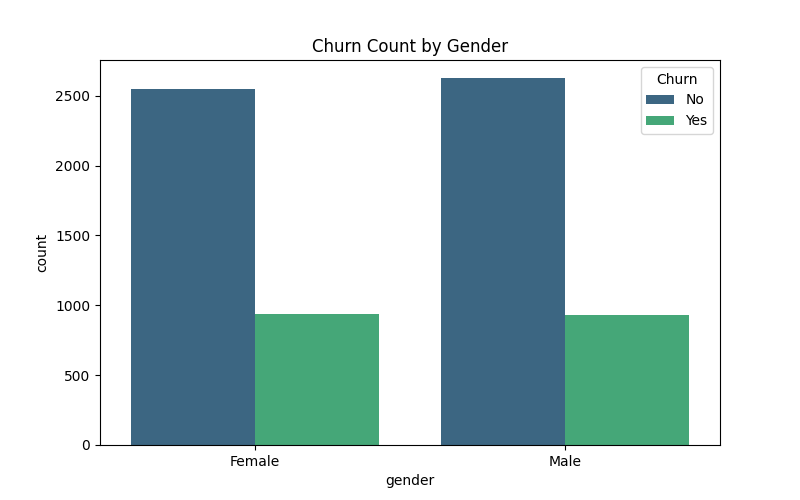

# 📊 Telecom Customer Churn Prediction 

## 🎯 Project Roadmap & Progress
This project helps a telecom company find out which customers might leave the service. I have used a professional "Modular" way to write the code.

| Stage | What I did | Status |
| :--- | :--- | :--- |
| **Stage 1** | **Looking at Data (Visuals)** | ✅ Done |
| **Stage 2** | **Cleaning the Data** | ✅ Done |
| **Stage 3** | **Simple Model (Logistic Regression)** | ✅ Done |
| **Stage 4** | **Better Model (Random Forest)** | ⏳ Working on it |
| **Stage 5** | **Making an App** | 📅 Planned |

---

## 🔍 Stage 1: Simple Data Analysis (EDA)
I checked many features to see why customers leave. Here are the 4 main things I found:

### 1. Contract Type Analysis

**Simple Observation:** There is a big difference between contract types. People who pay **month-to-month** leave very quickly. People who sign for **2 years** stay for a long time. 

### 2. Money and Time (Tenure & Charges)

**Simple Observation:** New customers (low tenure) are more likely to leave. Also, when the **monthly bill is high**, more people decide to stop using the service.

### 3. Internet Service Impact

**Simple Observation:** Customers with **Fiber Optic** internet are leaving more than DSL users. This could be because Fiber Optic is more expensive.

### 4. Gender Analysis

**Simple Observation:** Both **Male and Female** customers behave the same way. Gender does not tell us if a customer will leave or stay.

---

## ⚙️ Stage 2 & 3: How the Code Works
I wrote the code in different "Parts" (Classes) so it is easy to read and fix.

### Main Parts:
* **DataHandler:** This part loads the data, cleans it, and makes the graphs automatically.
* **ModelTrainer:** This part trains the computer to predict if a customer will leave.

### Current Results:
- **Accuracy:** `0.78 (78%)`
- **What this means:** My model is 78% correct in predicting if a customer will stay or leave.

---

## 📬 Contact
If you like this project or have any questions, please feel free to message me!
